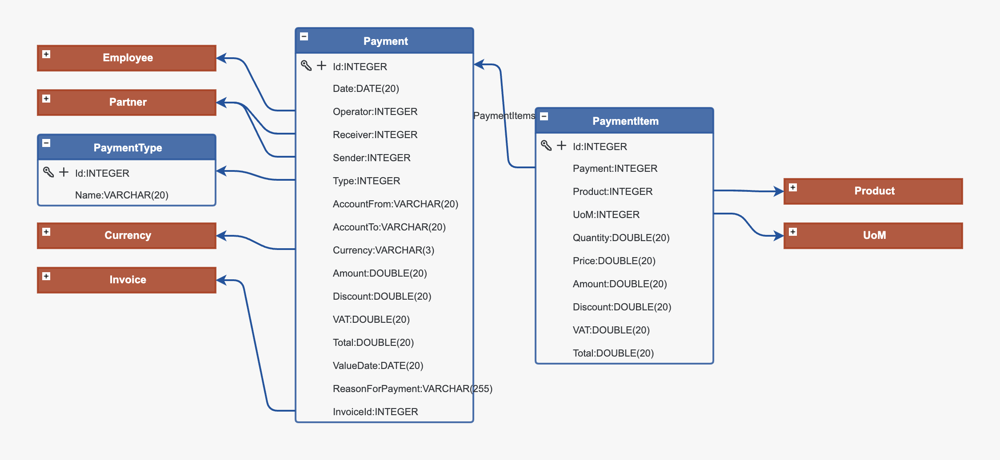
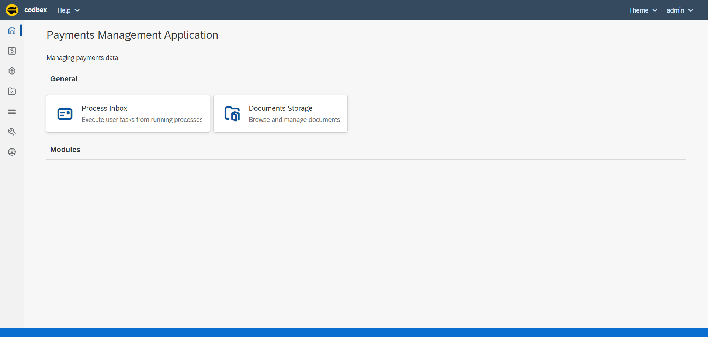
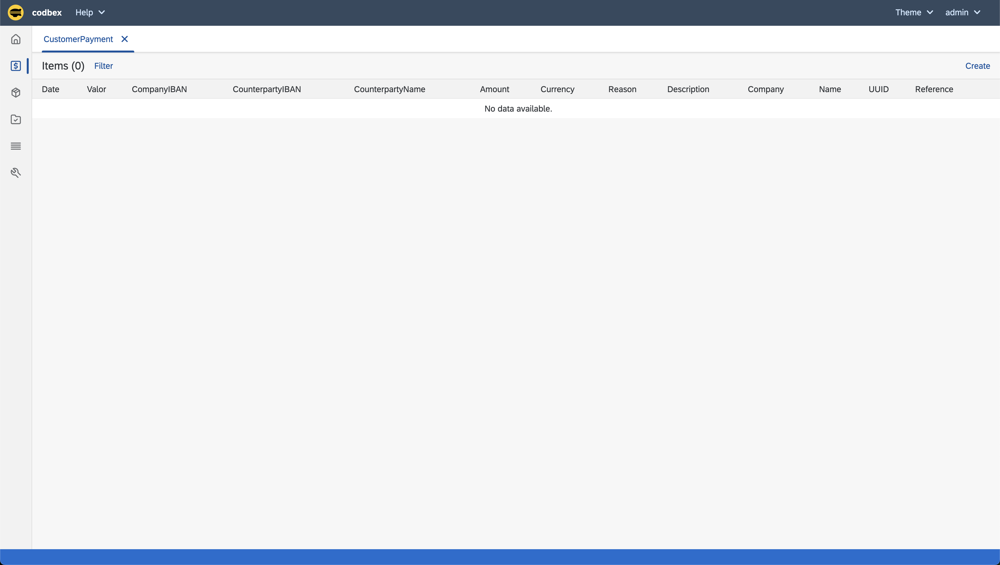
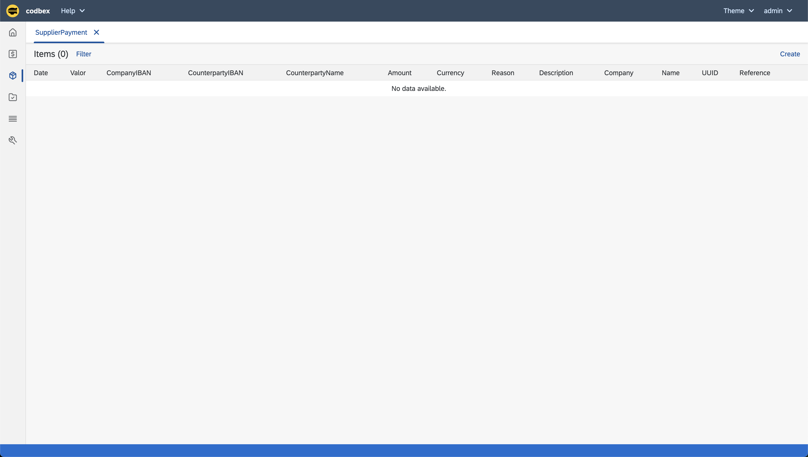
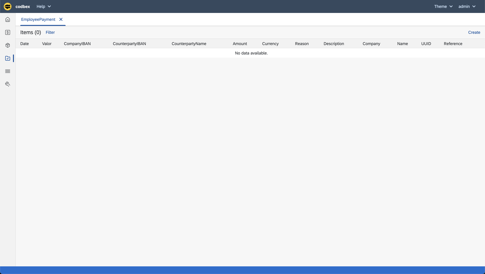
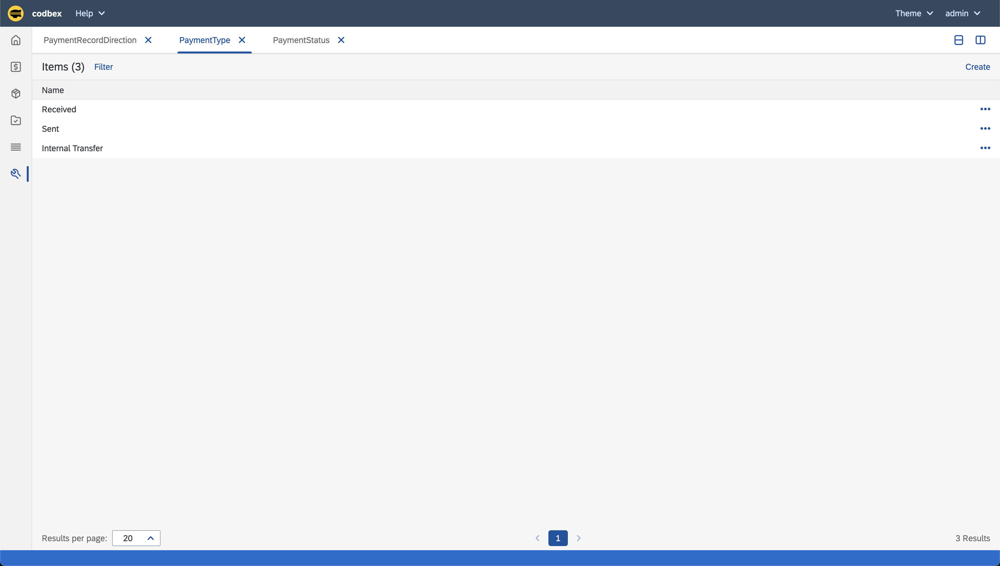
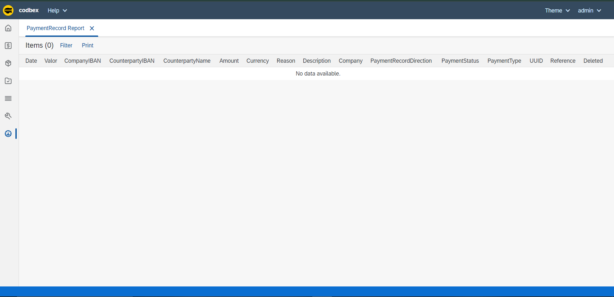

# codbex-payments
## Payments Management Applications

### Model


### Application

#### Launchpad



#### Management











## Local Development with Docker

When running this project inside the codbex Atlas Docker image, you must provide authentication for installing dependencies from GitHub Packages.
1. Create a GitHub Personal Access Token (PAT) with `read:packages` scope.
2. Pass `NPM_TOKEN` to the Docker container:

    ```
    docker run \
    -e NPM_TOKEN=<your_github_token> \
    --rm -p 80:80 \
    ghcr.io/codbex/codbex-atlas:latest
    ```

⚠️ **Notes**
- The `NPM_TOKEN` must be available at container runtime.
- This is required even for public packages hosted on GitHub Packages.
- Never bake the token into the Docker image or commit it to source control.
