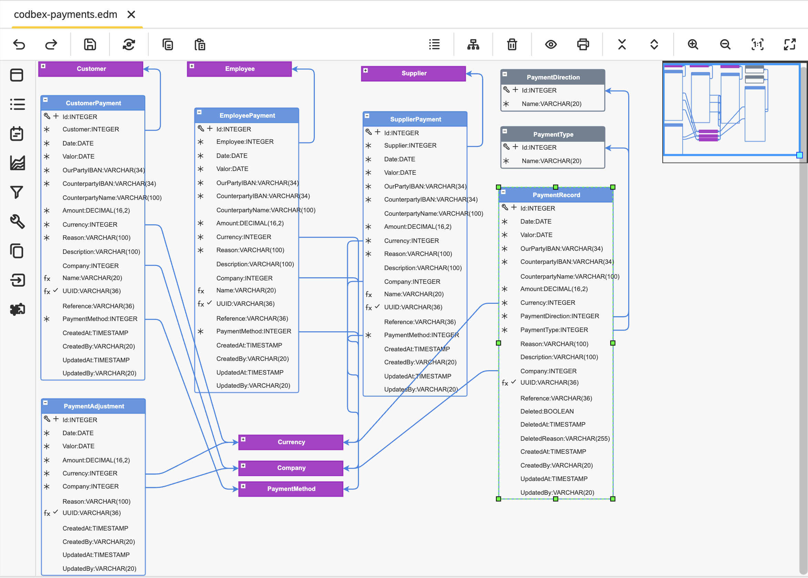

#  codbex-payments

## 📖 Table of Contents
* [🗺️ Entity Data Model (EDM)](#️-entity-data-model-edm)
* [🧩 Core Entities](#-core-entities)
* [📦 Dependencies](#-dependencies)
* [🔗 Sample Data Modules](#-sample-data-modules)
* [🐳 Local Development with Docker](#-local-development-with-docker)

## 🗺️ Entity Data Model (EDM)



## 🧩 Core Entities

### Entity: `CustomerPayment`

| Field            | Type      | Details                 | Description               |
| ---------------- | --------- | ----------------------- | ------------------------- |
| Id               | INTEGER   | PK, Identity            | Unique identifier.        |
| Customer         | INTEGER   | FK                      | Reference to customer.    |
| Date             | DATE      |                         | Payment date.             |
| Valor            | DATE      |                         | Value date.               |
| OurPartyIban     | VARCHAR   | Length: 34              | Our IBAN.                 |
| CounterpartyIban | VARCHAR   | Length: 34              | Counterparty IBAN.        |
| CounterpartyName | VARCHAR   | Length: 100, Nullable   | Counterparty name.        |
| Amount           | DECIMAL   | Precision: 16, Scale: 2 | Payment amount.           |
| Currency         | INTEGER   | FK                      | Currency reference.       |
| Reason           | VARCHAR   | Length: 100             | Payment reason.           |
| Description      | VARCHAR   | Length: 100, Nullable   | Description.              |
| Company          | INTEGER   | FK, Nullable            | Company reference.        |
| Name             | VARCHAR   | Length: 20, Nullable    | Payment name.             |
| Uuid             | VARCHAR   | Length: 36, Unique      | Unique identifier (UUID). |
| Reference        | VARCHAR   | Length: 36, Nullable    | External reference.       |
| PaymentMethod    | INTEGER   | FK                      | Payment method reference. |
| CreatedAt        | TIMESTAMP | Nullable                | Created at.               |
| CreatedBy        | VARCHAR   | Length: 20, Nullable    | Created by.               |
| UpdatedAt        | TIMESTAMP | Nullable                | Updated at.               |
| UpdatedBy        | VARCHAR   | Length: 20, Nullable    | Updated by.               |

### Entity: `SupplierPayment`

| Field            | Type      | Details                 | Description               |
| ---------------- | --------- | ----------------------- | ------------------------- |
| Id               | INTEGER   | PK, Identity            | Unique identifier.        |
| Supplier         | INTEGER   | FK                      | Reference to supplier.    |
| Date             | DATE      |                         | Payment date.             |
| Valor            | DATE      |                         | Value date.               |
| OurPartyIban     | VARCHAR   | Length: 34              | Our IBAN.                 |
| CounterpartyIban | VARCHAR   | Length: 34              | Counterparty IBAN.        |
| CounterpartyName | VARCHAR   | Length: 100, Nullable   | Counterparty name.        |
| Amount           | DECIMAL   | Precision: 16, Scale: 2 | Payment amount.           |
| Currency         | INTEGER   | FK                      | Currency reference.       |
| Reason           | VARCHAR   | Length: 100             | Payment reason.           |
| Description      | VARCHAR   | Length: 100, Nullable   | Description.              |
| Company          | INTEGER   | FK, Nullable            | Company reference.        |
| Name             | VARCHAR   | Length: 20, Nullable    | Payment name.             |
| Uuid             | VARCHAR   | Length: 36, Unique      | Unique identifier (UUID). |
| Reference        | VARCHAR   | Length: 36, Nullable    | External reference.       |
| PaymentMethod    | INTEGER   | FK                      | Payment method reference. |
| CreatedAt        | TIMESTAMP | Nullable                | Created at.               |
| CreatedBy        | VARCHAR   | Length: 20, Nullable    | Created by.               |
| UpdatedAt        | TIMESTAMP | Nullable                | Updated at.               |
| UpdatedBy        | VARCHAR   | Length: 20, Nullable    | Updated by.               |

### Entity `EmployeePayment`

| Field            | Type      | Details                 | Description               |
| ---------------- | --------- | ----------------------- | ------------------------- |
| Id               | INTEGER   | PK, Identity            | Unique identifier.        |
| Employee         | INTEGER   | FK                      | Reference to employee.    |
| Date             | DATE      |                         | Payment date.             |
| Valor            | DATE      |                         | Value date.               |
| OurPartyIban     | VARCHAR   | Length: 34              | Our IBAN.                 |
| CounterpartyIban | VARCHAR   | Length: 34              | Counterparty IBAN.        |
| CounterpartyName | VARCHAR   | Length: 100, Nullable   | Counterparty name.        |
| Amount           | DECIMAL   | Precision: 16, Scale: 2 | Payment amount.           |
| Currency         | INTEGER   | FK                      | Currency reference.       |
| Reason           | VARCHAR   | Length: 100             | Payment reason.           |
| Description      | VARCHAR   | Length: 100, Nullable   | Description.              |
| Company          | INTEGER   | FK, Nullable            | Company reference.        |
| Name             | VARCHAR   | Length: 20, Nullable    | Payment name.             |
| Uuid             | VARCHAR   | Length: 36, Unique      | UUID.                     |
| Reference        | VARCHAR   | Length: 36, Nullable    | External reference.       |
| PaymentMethod    | INTEGER   | FK                      | Payment method reference. |
| CreatedAt        | TIMESTAMP | Nullable                | Created at.               |
| CreatedBy        | VARCHAR   | Length: 20, Nullable    | Created by.               |
| UpdatedAt        | TIMESTAMP | Nullable                | Updated at.               |
| UpdatedBy        | VARCHAR   | Length: 20, Nullable    | Updated by.               |

### Entity `PaymentRecord`

| Field            | Type      | Details                 | Description          |
| ---------------- | --------- | ----------------------- | -------------------- |
| Id               | INTEGER   | PK, Identity            | Unique identifier.   |
| Date             | DATE      |                         | Payment date.        |
| Valor            | DATE      |                         | Value date.          |
| OurPartyIban     | VARCHAR   | Length: 34              | Our IBAN.            |
| CounterpartyIban | VARCHAR   | Length: 34              | Counterparty IBAN.   |
| CounterpartyName | VARCHAR   | Length: 100, Nullable   | Counterparty name.   |
| Amount           | DECIMAL   | Precision: 16, Scale: 2 | Amount.              |
| Currency         | INTEGER   | FK                      | Currency reference.  |
| PaymentDirection | INTEGER   | FK                      | Payment direction.   |
| PaymentType      | INTEGER   | FK                      | Payment type.        |
| Reason           | VARCHAR   | Length: 100, Nullable   | Reason.              |
| Description      | VARCHAR   | Length: 100, Nullable   | Description.         |
| Company          | INTEGER   | FK, Nullable            | Company reference.   |
| Uuid             | VARCHAR   | Length: 36, Unique      | UUID.                |
| Reference        | VARCHAR   | Length: 36, Nullable    | Reference.           |
| Deleted          | BOOLEAN   | Nullable                | Soft delete flag.    |
| DeletedAt        | TIMESTAMP | Nullable                | Deletion timestamp.  |
| DeletedReason    | VARCHAR   | Length: 255, Nullable   | Reason for deletion. |
| CreatedAt        | TIMESTAMP | Nullable                | Created at.          |
| CreatedBy        | VARCHAR   | Length: 20, Nullable    | Created by.          |
| UpdatedAt        | TIMESTAMP | Nullable                | Updated at.          |
| UpdatedBy        | VARCHAR   | Length: 20, Nullable    | Updated by.          |

### Entity `PaymentType`

| Field | Type    | Details      | Description        |
| ----- | ------- | ------------ | ------------------ |
| Id    | INTEGER | PK, Identity | Unique identifier. |
| Name  | VARCHAR | Length: 20   | Payment type name. |

### Entity `PaymentDirection`

| Field | Type    | Details      | Description             |
| ----- | ------- | ------------ | ----------------------- |
| Id    | INTEGER | PK, Identity | Unique identifier.      |
| Name  | VARCHAR | Length: 20   | Payment direction name. |

### Entity `PaymentAdjustment`

| Field     | Type      | Details                      | Description         |
| --------- | --------- | ---------------------------- | ------------------- |
| Id        | INTEGER   | PK, Identity                 | Unique identifier.  |
| Date      | DATE      |                              | Adjustment date.    |
| Valor     | DATE      |                              | Value date.         |
| Amount    | DECIMAL   | Precision: 16, Scale: 2      | Adjustment amount.  |
| Currency  | INTEGER   | FK                           | Currency reference. |
| Company   | INTEGER   | FK                           | Company reference.  |
| Reason    | VARCHAR   | Length: 100, Nullable        | Reason.             |
| Uuid      | VARCHAR   | Length: 36, Unique, Nullable | UUID.               |
| CreatedAt | TIMESTAMP | Nullable                     | Created at.         |
| CreatedBy | VARCHAR   | Length: 20, Nullable         | Created by.         |
| UpdatedAt | TIMESTAMP | Nullable                     | Updated at.         |
| UpdatedBy | VARCHAR   | Length: 20, Nullable         | Updated by.         |


## 📦 Dependencies

- [codbex-partners](https://github.com/codbex/codbex-partners)
- [codbex-companies](https://github.com/codbex/codbex-companies)
- [codbex-employees](https://github.com/codbex/codbex-employees)
- [codbex-currencies](https://github.com/codbex/codbex-currencies)
- [codbex-number-generator](https://github.com/codbex/codbex-number-generator)
- [codbex-number-generator-data](https://github.com/codbex/codbex-number-generator-data)
- [codbex-navigation-groups](https://github.com/codbex/codbex-navigation-groups)

## 🔗 Sample Data Modules

- [codbex-payments-data](https://github.com/codbex/codbex-payments-data)

## 🐳 Local Development with Docker

When running this project inside the codbex Atlas Docker image, you must provide authentication for installing dependencies from GitHub Packages.
1. Create a GitHub Personal Access Token (PAT) with `read:packages` scope.
2. Pass `NPM_TOKEN` to the Docker container:

    ```
    docker run \
    -e NPM_TOKEN=<your_github_token> \
    --rm -p 80:80 \
    ghcr.io/codbex/codbex-atlas:latest
    ```

⚠️ **Notes**
- The `NPM_TOKEN` must be available at container runtime.
- This is required even for public packages hosted on GitHub Packages.
- Never bake the token into the Docker image or commit it to source control.